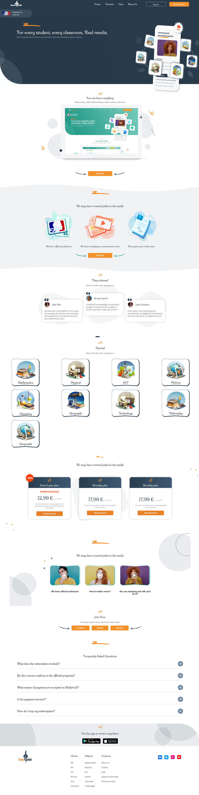

Study Gene App
This web application, the Study Gene App, is designed to provide a comprehensive educational experience for students. It incorporates features such as navigation, user authentication, mobile responsiveness, and sections for learning, testimonials, tutorials, subscription plans, and more.

## Screenshots

Table of Contents
Features
Getting Started
Usage
Contributing
License
Features
Navigation: Easy navigation with links to home, tutorials, class, and about us.
User Authentication: Log in or register for a new account.
Mobile Navigation: Responsive design with a mobile-friendly drawer.
Main Image Section: Catchy headline and mission statement.
Learn Anything Section: Encourages users to join and learn.
Mathrix Section: Testimonials, images, and a call-to-action button.
Witness Section: User testimonials from YouTube with images.
Tutorial Section: Displays subjects with associated images.
Plan Cards Section: Different subscription plans with discount indicators.
Video Cards Section: Showcase videos with thumbnails and descriptions.
Join Now Section: Buttons for students, parents, and teachers.
FAQ Section: Informative Frequently Asked Questions.
Getting Started
To run the Study Gene App locally:

Clone the repository.
Open the index.html file in a web browser.
Usage
Explore the app's home page to discover different features.
Navigate through the various sections using the navigation bar.
Join challenges, customize your learning experience, and track your progress.
Participate in tutorials and explore different subjects.
Check out subscription plans in the Packages section.
Contributing
Contributions to this project are welcome! Feel free to submit a pull request with any improvements or suggestions.
